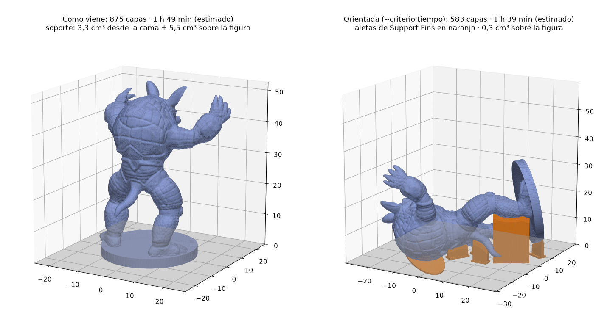

# Orientación de figuras + Support Fins

`orientar.mjs` busca la orientación de impresión de una figura y te da los ángulos listos para [Support Fins](https://printfins.com): el mismo `X · Y · Z` que muestra la web y que acepta su línea de comandos (`--rot`). Con `--fins`, además hornea las aletas y deja un `.3mf` listo para Bambu Studio.



*Prueba con una figura de 50 mm sobre peana (el Armadillo de Stanford), capa de 0,06 mm.*

## Instalación (una vez)

Requiere Node.js 20.10 o más y git. No usa paquetes de npm.

```bash
cd tools/orientacion
bash setup.sh        # descarga Support Fins en una versión fija (solo hace falta para --fins)
```

## Uso

```bash
# una figura
node orientar.mjs --in roy.stl

# toda la carpeta de personajes, con aletas y STL ya girado
node orientar.mjs --in fire_emblem/ --fins --exportar

# los modelos de Meshy suelen venir en otra escala: llévalos a 60 mm de alto
node orientar.mjs --in fire_emblem/ --alto 60 --fins

# priorizar el tiempo estimado en vez de la cantidad de capas
node orientar.mjs --in roy.stl --criterio tiempo
```

En una carpeta, los resultados van a `<carpeta>/orientado/`, junto con `orientaciones.csv` (una fila por figura).

## Qué mide

| Columna | Qué es |
|---|---|
| `capas` | Altura ÷ altura de capa. Es lo que se ahorra al acostar la figura. |
| `c.masa` | Altura del centro de masa. Bajo = más estable. **No define las capas**: las define la altura total. |
| `sop.cama` | Volumen envolvente bajo voladizos que apoya en la cama. El filamento real es ~15% de eso. |
| `sop.fig` | Volumen envolvente de soporte que **apoya sobre la propia figura** (los "soportes internos"). Cuenta doble en el orden porque deja marcas en zonas visibles. |
| `islas` | Puntas que cuelgan en el aire (dedos, puntas de espada, mechones) y necesitan su propio soporte. |
| `apoyo` | Área en contacto con la cama. |
| `estable` | Si el centro de masa cae dentro del apoyo. Si dice "no", deja el *bed pad* de Support Fins en Auto o usa brim. |
| `tiempo est.` | Estimación relativa (ver abajo). Sirve para comparar orientaciones, no para planificar. |

Una cara necesita soporte si forma menos de `--umbral` grados con la cama (por defecto 45°, igual que Support Fins).

## Criterios

- **`capas`** (por defecto): la menor cantidad de capas. Entre las orientaciones que están a no más de `--tolerancia` (10%) del mínimo, gana la de menos soporte. Así una pose 3% más alta que necesita la mitad de soporte le gana a la más plana.
- **`tiempo`**: el menor tiempo estimado.
- **`soportes`**: el menor soporte. A igualdad, menos capas.

### Menos capas no siempre es más rápido

Cada capa tarda lo que lleva extruirla o el **tiempo mínimo de capa** (el filamento necesita enfriarse), lo que sea mayor, más el cambio de capa. En figuras chicas muchas capas (brazos, cabeza, armas) quedan en ese mínimo, así que menos capas sí ahorra tiempo. Pero acostar una figura suele agregar soporte, y eso también lleva tiempo. Por eso la herramienta avisa cuando la más rápida estimada no coincide con la elegida.

El estimador usa `maquina.json` (boquilla 0,2 · capa 0,06 · 2 paredes · 15% de relleno · velocidades efectivas). Para acercarlo al tiempo real, lamina una figura en Bambu Studio, compara y ajusta `factor`.

## Lo que la herramienta no ve

- **Dónde quedan las líneas de capa.** Una figura acostada imprime la cara y el pecho de costado: líneas de capa cruzando la cara y, del lado de la cama, la textura de la placa y marcas de aletas. Para piezas de vitrina suele convenir parada aunque tenga más capas. Para pintar, acostada está bien.
- **La resistencia.** La pieza es más débil entre capas: tobillos, espadas y lanzas finas aguantan mejor si quedan paralelos a la cama.
- **Peana separada.** Si la peana es una pieza aparte, oriéntala sola: siempre va plana.

## Support Fins con capa de 0,06 mm

Los dientes de las aletas miden **una capa** de alto para que se suelten limpios. Support Fins acepta de 0,08 a 0,4 mm, así que con 0,06 la herramienta los genera para 0,08 y te avisa. Opciones:

1. Laminar todo a **0,08 mm** (cámbialo en el perfil de la boquilla de 0,2): los dientes calzan exactos.
2. Laminar a 0,06 y aceptar que los dientes ocupen ~1,3 capas: agarran más y cuesta un poco más quitarlos.

Support Fins está pensado para piezas con aristas. En figuras orgánicas suele avisar `overhangs are too shallow for a fin this way up`: esas zonas no llevan aleta, así que activa soporte de árbol en Bambu Studio **solo en esas zonas** (pintando soporte). Si avisa `one piece isn't joined to the rest`, el modelo tiene cuerpos separados: únelos (booleana en Bambu Studio o reparación de Meshy) antes de orientar.

Opciones extra para Support Fins con `--fins-args`, por ejemplo:

```bash
node orientar.mjs --in roy.stl --fins --fins-args "--material petg --tine-density 30"
```

## Validación

Se verificó que el `--rot` que devuelve deja la figura exactamente a la altura calculada dentro del `.3mf` de Support Fins (48,613 mm calculados = 48,613 mm en el archivo).

## Licencia

Support Fins es de [gittrahan/support-fins](https://github.com/gittrahan/support-fins), con licencia MIT. `setup.sh` lo descarga aparte en `vendor/`, y no se copia en este repositorio.
